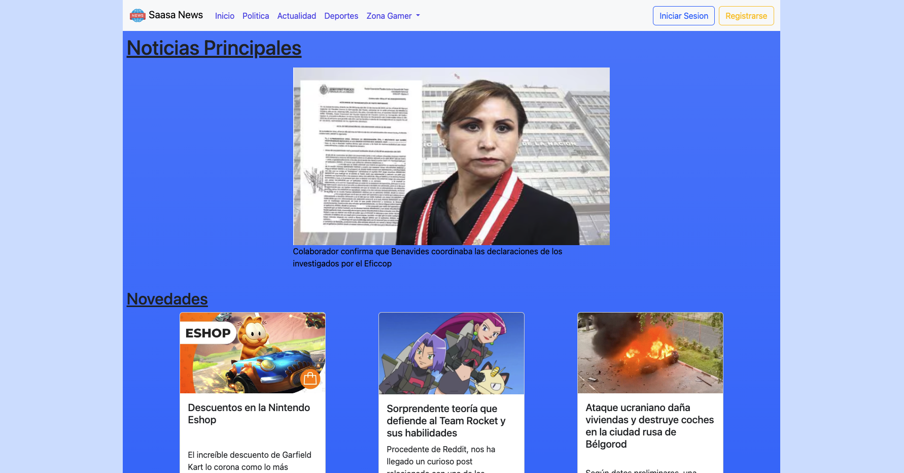
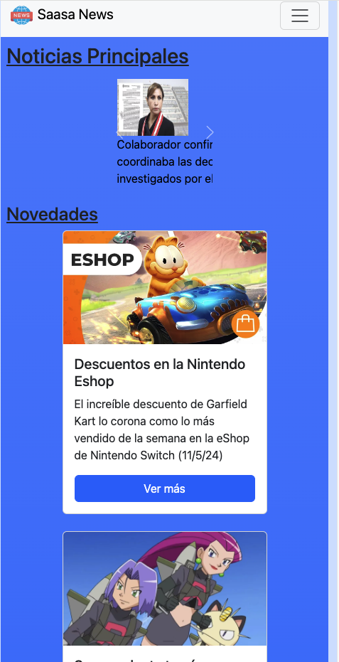

# Tarea: Landing page con Bootstrap
El presente proyecto consiste en una landing page utilizando el framework de CSS Bootstrap. El tema elegido de la página es un portal de noticias.

## Division de la pagina
La pagina de Inicio cuenta con 3 secciones: header, main y footer.
   * Dentro del header tenemos el menu de navegacion, banner del portal de noticias y unos botones para iniciar sesion o registrarse
   * En la seccion main tenemos distintos articles para separar los distintos subtitulos. 
     * Noticias Principales: cuenta con un carrusel de imágenes con texto debajo con hiperlink a la noticia desarrollada.
     * Novedades: Coleccion de cards con ultimas noticias de distintos géneros.
     * Comentarios: Un pequeño formulario un campo para ingresar su nombre y otro para ingresar un mensaje.
     * Suscribrise: Un pequeño formulario para que el usuario pueda ingresar su correo si desea suscribirse al boletin diario de la página.
   * En el footer se encuentra el copyright de la página; asi como tambien los accesos a las redes sociales del portal. 

**Version Escritorio**
   

**Version Mobile**

   